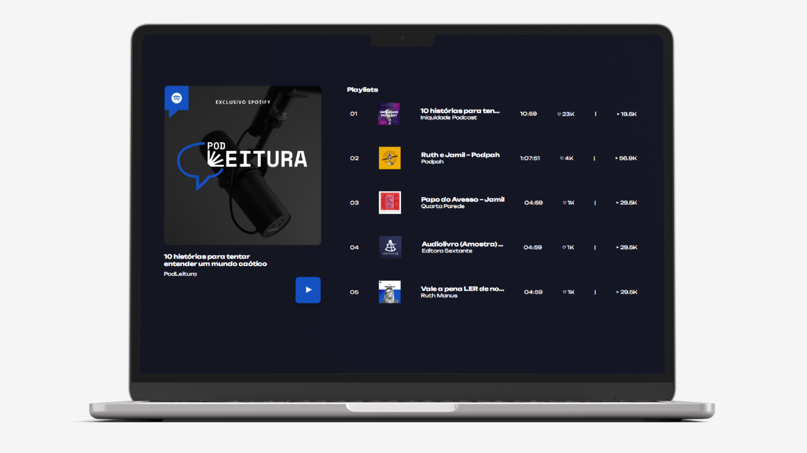

# 🎙️ | PodLeitura

O PodLeitura é um projeto desenvolvido para um trabalho escolar que inicialmente tinha como objetivo criar um podcast baseado no livro "10 histórias para tentar entender um mundo caótico". Porém, decidi ir além e criar uma página web para que os usuários pudessem desfrutar dessa maravilha de forma prática e acessível. Então, prepare seus fones de ouvido, acomode-se confortavelmente e mergulhe nesse bate papo!
 

## 💻 *| Preview do website*

## 🎛️ *| Recursos*

O PodLeitura é uma aplicação web simples e intuitiva, desenvolvida utilizando as seguintes tecnologias:

   **| HTML5:** para a estruturação da página web; 
   **| CSS3:** para a estilização e aparência da página; 
   **| JavaScript:** para a interação e funcionalidades da página; 
   **| Reprodutor de Áudio:** para a reprodução do nosso podcast.
